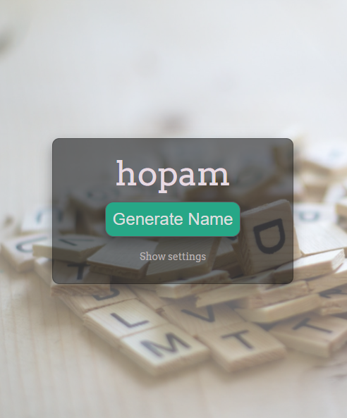
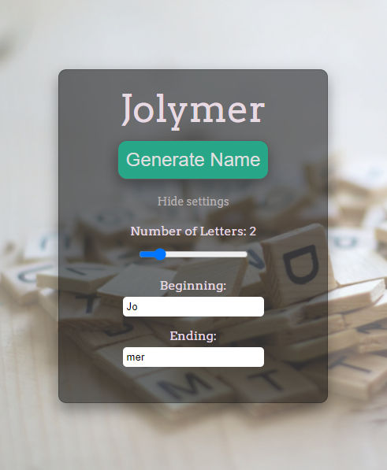

# Namy
## Overview

Namy is a random name generator. Through settings users can control the length of the generated word and also they can add beginning or/and ending to it.

## How to run?
Open `index.html` in a browser.

## Screens

### Initial page
 

### Generate word
 

### Settings
 
